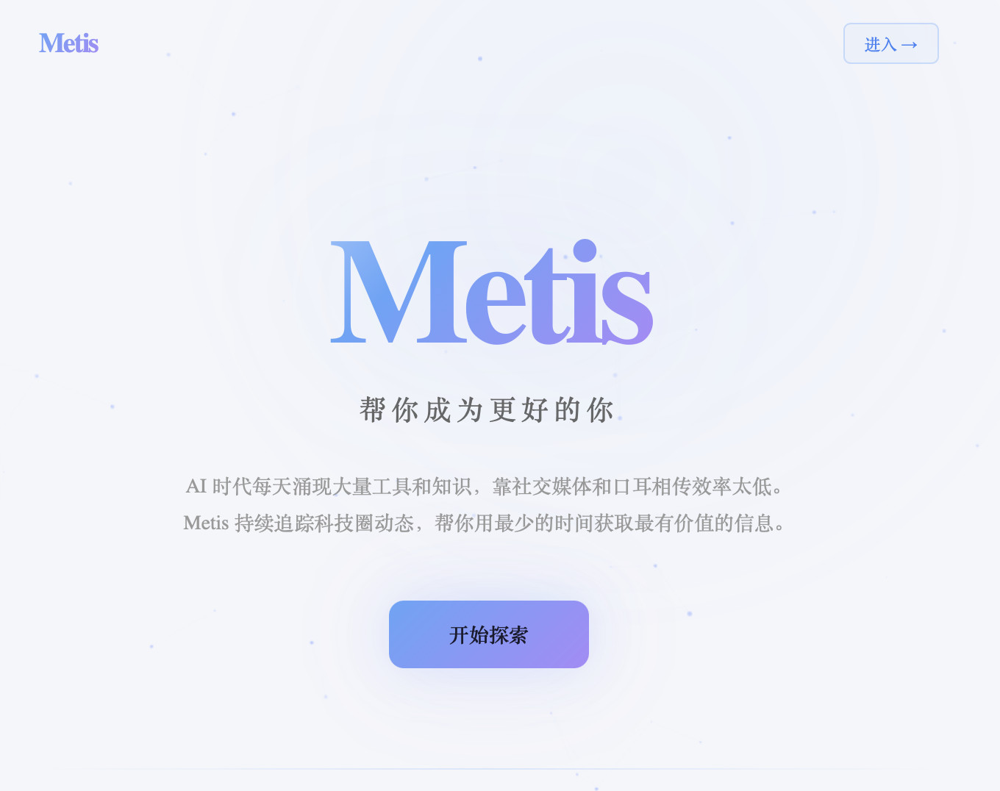

# Metis

[English](#metis) | [中文](#中文说明)

[](https://github.com/Kevinxnova/metis/actions/workflows/ci.yml)



Metis is a bilingual AI-tool discovery desk. It gathers fresh projects and
technology news, removes duplicates, enriches the results with AI, and gives a
human curator a focused workflow for publishing recommendations and newsletters.

The project is an early-stage personal tool. Expect the data model and UI to
evolve.

## What it does

- Collects GitHub Trending, Hacker News, Product Hunt, and selected AI RSS feeds.
- Normalizes URLs and merges discoveries that appear in more than one source.
- Uses AI models such as GPT, Claude, MiniMax, GLM, or DeepSeek for
  classification, trend scoring, summaries, recommendations, and AI
  introductions. The included reference integration currently defaults to
  MiniMax.
- Publishes a bilingual discovery page and AI daily briefing.
- Provides a password-protected curation dashboard.
- Stores data in local SQLite or a hosted Turso database.
- Can send curated issues through Buttondown.

## Architecture

```text
GitHub / HN / Product Hunt / RSS
                  │
                  ▼
          scraper + deduplication
                  │
                  ▼
       SQLite locally / Turso in production
                  │
          ┌───────┴────────┐
          ▼                ▼
   Flask JSON API    scheduled AI pipeline
          │
          ▼
     React + Vite UI ──────► Buttondown
```

The Flask app is served from `backend/api/main.py`. Vercel function entry
points live under `api/`; the React application lives under `frontend/`.

## Quick start

Prerequisites:

- Python 3.12 or 3.13
- Node.js 20+

```bash
git clone https://github.com/Kevinxnova/metis.git
cd metis

python3 -m venv .venv
source .venv/bin/activate
pip install -r requirements-dev.txt

cp .env.example .env
# Add strong ADMIN_PASSWORD and CRON_SECRET values, plus any optional API keys.

cd frontend
npm ci
cd ..
```

Start the API:

```bash
./scripts/start-backend.sh
```

Verify the API in another terminal:

```bash
curl http://127.0.0.1:8000/api/health
```

In a second terminal, start the frontend:

```bash
cd frontend
npm run dev
```

Open [http://localhost:5173](http://localhost:5173). The curator dashboard is
available at `/admin`.

To collect data manually:

```bash
source .venv/bin/activate
python -m backend.scheduler
```

## Configuration

Copy `.env.example` to `.env`. Never commit the resulting `.env` file.

| Variable | Purpose | Required |
| --- | --- | --- |
| `ADMIN_PASSWORD` | Protects curator data and every privileged API route | For admin access |
| `CRON_SECRET` | Bearer token required by all scheduled-task routes | For scheduled tasks |
| `MINIMAX_API_KEY` | AI recommendations, summaries, scoring, and daily news | For AI features |
| `TURSO_DATABASE_URL` | Hosted Turso database URL | No; local SQLite is the default |
| `TURSO_AUTH_TOKEN` | Turso authentication token | With a Turso URL |
| `TRANSLATION_API_URL` | Opt-in LibreTranslate-compatible `/translate` endpoint | No |
| `TRANSLATION_API_KEY` | Authentication for the configured translation endpoint | No |
| `PRODUCTHUNT_API_TOKEN` | Product Hunt GraphQL access | No |
| `BUTTONDOWN_API_KEY` | Newsletter delivery | No |
| `ALLOWED_ORIGINS` | Comma-separated browser origins allowed by CORS | In production |
| `VITE_API_URL` | Build-time frontend API origin | Only when API and UI use different origins |

Use long, unique values for `ADMIN_PASSWORD` and `CRON_SECRET`. Only expose the
admin UI over HTTPS. Translation is disabled unless `TRANSLATION_API_URL` is
explicitly configured; text sent there is governed by that provider's privacy
policy.

## Tests

```bash
source .venv/bin/activate
pytest

cd frontend
npm run build
```

The live Turso/MiniMax integration suite is disabled by default. Run it only
against an environment you control:

```bash
METIS_RUN_INTEGRATION_TESTS=1 pytest -m integration -s
```

## Community privacy

Messages submitted on the Community page are public. A submitted nickname,
message, and submission date can be read by anyone who visits the page. Do not
submit email addresses, phone numbers, credentials, or other personal or
sensitive information.

## Deployment

See [DEPLOY.md](DEPLOY.md) for Vercel, Turso, cron security, and self-hosting
instructions.

## Contributing

Bug reports and focused pull requests are welcome. Read
[CONTRIBUTING.md](CONTRIBUTING.md) before opening a change. For vulnerabilities,
follow [SECURITY.md](SECURITY.md) and do not create a public issue.

## License

Metis is available under the [MIT License](LICENSE).

---

## 中文说明

Metis 是一个中英双语的 AI 工具发现与策展平台。它持续收集新项目和科技
资讯，自动去重并通过 AI 进行分类、评分、摘要和推荐，再交给人工完成精选
与发布。

项目目前仍处于早期阶段，数据模型和界面可能继续调整。

### 主要功能

- 采集 GitHub Trending、Hacker News、Product Hunt 和精选 AI 新闻 RSS。
- 规范化链接并合并来自多个数据源的重复项目。
- 可使用 GPT、Claude、MiniMax、GLM、DeepSeek 等 AI 模型完成分类、趋势评分、
  摘要、推荐和 AI 简介；当前仓库中的参考实现默认接入 MiniMax。
- 提供中英双语的发现页与 AI 每日简报。
- 提供受密码保护的策展后台。
- 支持本地 SQLite 或云端 Turso 数据库。
- 可通过 Buttondown 发送人工精选 Newsletter。

### 项目结构

- `backend/`：Flask API、数据库、爬虫、去重、AI 管线、翻译和邮件发送。
- `frontend/`：React + TypeScript + Vite 前端。
- `api/`：Vercel Serverless Function 和定时任务入口。
- `scripts/`：本地启动、初始化、补数据和批处理脚本。
- `tests/`：后端安全、翻译、邮件和每日新闻测试。
- `docs/`：产品设计、版本更新和实现记录。

### 快速开始

环境要求：

- Python 3.12 或 3.13
- Node.js 20+

```bash
git clone https://github.com/Kevinxnova/metis.git
cd metis

python3 -m venv .venv
source .venv/bin/activate
pip install -r requirements-dev.txt

cp .env.example .env
# 请为 ADMIN_PASSWORD 和 CRON_SECRET 设置不同的强随机值。

cd frontend
npm ci
cd ..
```

启动后端：

```bash
./scripts/start-backend.sh
```

在另一个终端验证 API：

```bash
curl http://127.0.0.1:8000/api/health
```

再启动前端：

```bash
cd frontend
npm run dev
```

打开 [http://localhost:5173](http://localhost:5173)。策展后台位于
`/admin`。

手动执行一次数据采集：

```bash
source .venv/bin/activate
python -m backend.scheduler
```

### 配置项

复制 `.env.example` 为 `.env`，不要把生成的 `.env` 提交到 Git。

| 变量 | 用途 | 是否必需 |
| --- | --- | --- |
| `ADMIN_PASSWORD` | 保护策展后台和所有管理接口 | 使用后台时必需 |
| `CRON_SECRET` | 保护所有定时任务接口 | 使用定时任务时必需 |
| `MINIMAX_API_KEY` | AI 推荐、摘要、评分和每日新闻 | 使用 AI 功能时必需 |
| `TURSO_DATABASE_URL` | Turso 云数据库地址 | 否，默认使用本地 SQLite |
| `TURSO_AUTH_TOKEN` | Turso 认证令牌 | 配置 Turso 时必需 |
| `TRANSLATION_API_URL` | 可选的 LibreTranslate 兼容接口 | 否 |
| `TRANSLATION_API_KEY` | 翻译接口认证 | 否 |
| `PRODUCTHUNT_API_TOKEN` | Product Hunt GraphQL API | 否 |
| `BUTTONDOWN_API_KEY` | 发送 Newsletter | 否 |
| `ALLOWED_ORIGINS` | CORS 允许的前端域名 | 生产环境需要配置 |
| `VITE_API_URL` | 前后端分离部署时的 API 地址 | 按部署方式决定 |

`ADMIN_PASSWORD` 与 `CRON_SECRET` 应使用不同的长随机值。管理后台只应通过
HTTPS 暴露。只有显式配置 `TRANSLATION_API_URL` 后，翻译内容才会发送到外部
服务。

### 测试

```bash
source .venv/bin/activate
pytest

cd frontend
npm run build
```

实时 Turso/MiniMax 集成测试默认关闭，只应在你控制的测试环境中运行：

```bash
METIS_RUN_INTEGRATION_TESTS=1 pytest -m integration -s
```

### 社区留言隐私

Community 页面上的留言是公开内容。提交后的昵称、留言内容和日期会展示给
所有访问者。请勿提交邮箱、电话号码、账号密码、API Key 或其他个人与敏感
信息。

### 部署、贡献与许可证

- 部署说明见 [DEPLOY.md](DEPLOY.md)。
- 提交 Issue 或 Pull Request 前请阅读 [CONTRIBUTING.md](CONTRIBUTING.md)。
- 安全问题请按 [SECURITY.md](SECURITY.md) 私下报告，不要创建公开 Issue。
- Metis 使用 [MIT License](LICENSE) 开源。
